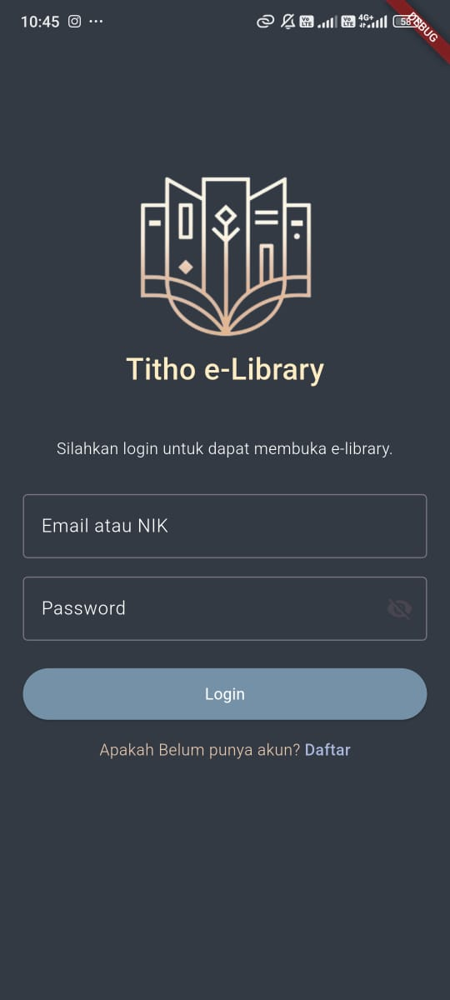
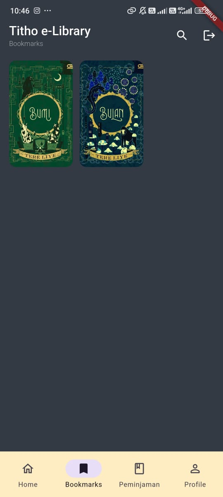
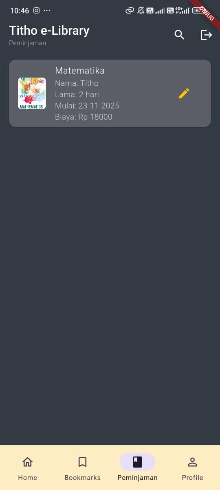
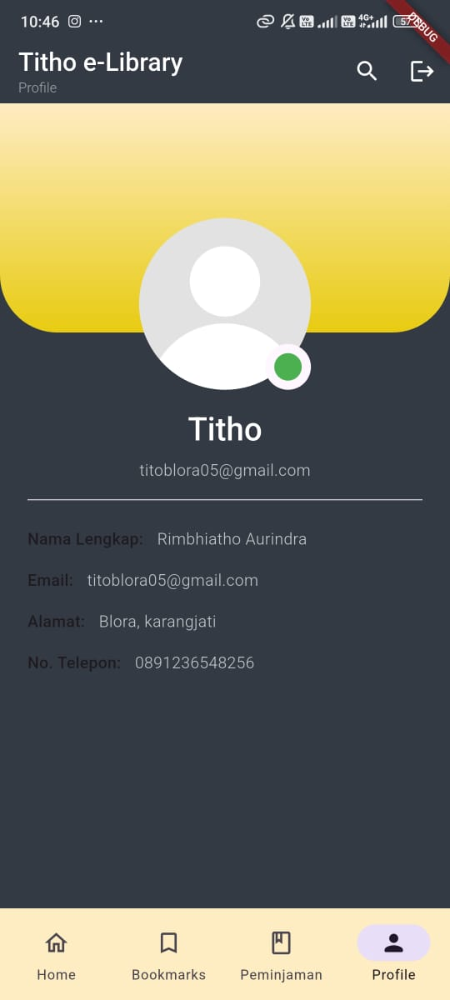

## 📸 Tampilan Aplikasi

### 🔐 Login

### 🏠 Home Menu

### 📖 Deskripsi Buku

### 📝 Form Peminjaman

### 📌 Bookmark

### 📂 Riwayat

### 👤 Profil

# 📚 Flutter E-Library App

Aplikasi perpustakaan digital berbasis Flutter yang memungkinkan pengguna untuk melihat, meminjam, dan mengelola koleksi buku secara efisien.

## 🚀 Fitur Utama
- 🔍 Pencarian dan filter buku
- 📖 Detail buku lengkap (judul, penulis, sinopsis)
- 📝 Fitur peminjaman dan histori transaksi
- 📌 Bookmark buku favorit
- 👤 Profil pengguna (nama, email, alamat, telepon)
- 🗑️ Hapus data user dan bookmark dari database

## 🛠️ Teknologi
- **Flutter** & **Dart**
- **Sqflite** untuk database lokal
- **Provider** / **GetX** untuk state management
- **Custom UI/UX** dengan layout responsif

## Vudio demo
https://drive.google.com/file/d/1NLao_ZLqwqVMfKGxjWVExPpCZHN6Zf1L/view?usp=drivesdk

##Inspirasi Desain
UISI e-library

## Alur penggunaan
1. 🔐 Login
- Pengguna masuk dengan akun yang sudah terdaftar.
- Validasi username & password.
- Kalau berhasil → diarahkan ke Home Menu.

2. 🏠 Home Menu
- Menampilkan menu utama aplikasi.
- Navigasi ke fitur: Deskripsi Buku, Form Peminjaman, Riwayat, Bookmark, Profi.

3. 📖 Deskripsi Buku
- Pengguna memilih buku dari daftar.
- Detail buku ditampilkan: judul, penulis, kategori, deskripsi.
- Ada opsi Pinjam Buku → diarahkan ke Form Peminjaman.

4. 📝 Form Peminjaman
- Pengguna mengisi data peminjaman (, jumlah hari, tanggal).
- Submit → data tersimpan ke sistem.
- Setelah berhasil → diarahkan ke Riwayat Peminjaman.

5. 📂 Riwayat Peminjaman
- Menampilkan daftar buku yang pernah dipinjam.
- Status: sedang dipinjam / sudah dikembalikan.
- Bisa dipakai untuk tracking aktivitas pengguna.

6. 📌 Bookmark
- Pengguna bisa menandai buku favorit.
- Buku yang di‑bookmark muncul di daftar khusus.
- Memudahkan akses cepat ke buku favorit.

7. 👤 Profil
- Menampilkan data pengguna (nama, email, dll).

